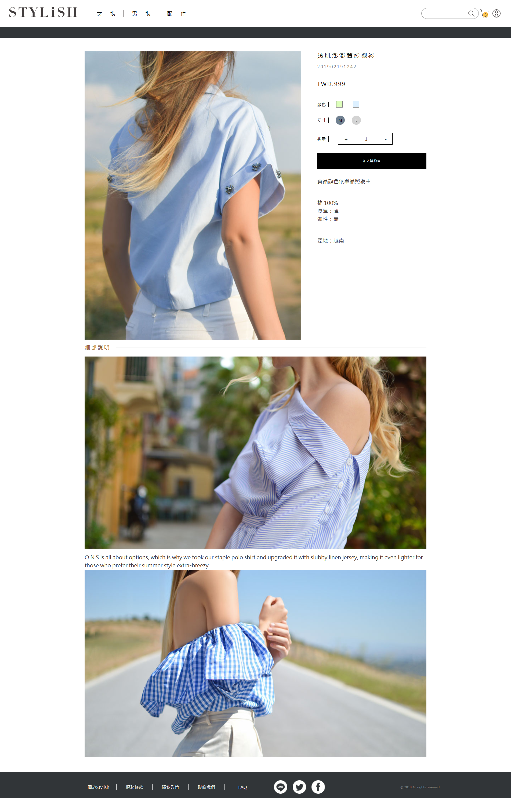
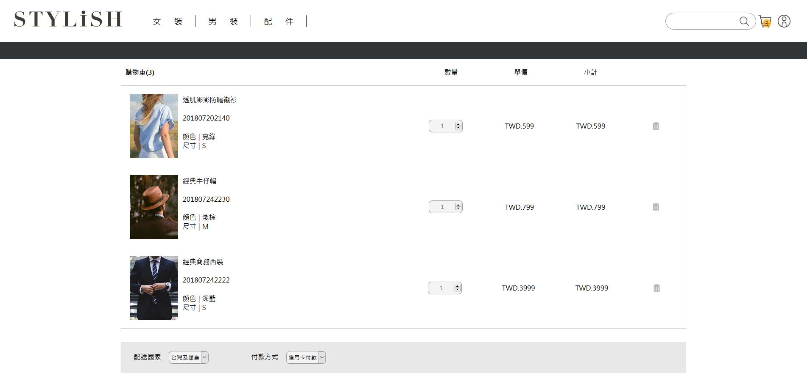

# STYLiSH

### A fashion e-Commerce website
##### Web Link:    

## Technologies
* HTML
* CSS
* RWD
* TapPay
* Facebook API

## Features
 * Implemented RWD with pure HTML and CSS
 * Connected to Backend API with AJAX for data capture
 * Established products search and loading pages with infinite scroll features to enhance user experience
 * A complete check out system integrated TapPay"s payment SDK
 * Implemented member system (Native and Facebook Login) 
 ### Product page

 
 ### Shopping cart feature

 ### Carousel slider

 
